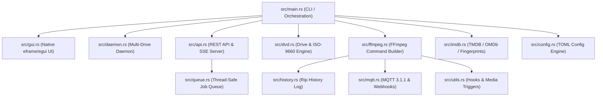

# System Architecture Guide - `dvd-ripper`

## 1. Overview

`dvd-ripper` is an enterprise-grade DVD backup and media processing appliance written in pure Rust. It provides:
- A native desktop immediate-mode GUI powered by `eframe`/`egui`.
- A command-line interface (CLI) powered by `clap`.
- An embedded HTTP REST API and Server-Sent Events (SSE) server (`api`).
- A multi-drive parallel watcher daemon (`daemon`).
- Home Assistant MQTT smart home integration (`mqtt`).
- Disc fingerprinting and local database caching (`dvd`, `imdb`).
- Direct media server scan triggers (Plex, Jellyfin, Emby) and post-processing script hooks (`utils`).

---

## 2. Module Responsibilities



### Module Breakdown

1. **`src/main.rs`**: Application entry point, CLI flag parsing, configuration default merging, metadata search & selection resolution, and ripping pipeline execution.
2. **`src/cli.rs`**: Definitions for `Args` command-line argument schema.
3. **`src/config.rs`**: TOML configuration parser (`dvd-ripper.toml` / `~/.dvd-ripper/config.toml`) and default parameter application.
4. **`src/dvd.rs`**: Optical drive auto-detection (Windows Win32, Linux `/dev/sr*`, macOS), volume label extraction, optical tray ejection, ISO-9660 Sector 16 volume descriptor hashing, copy protection analysis (CSS/CPPM), and Optical Drive Read Speed Benchmark Engine (`run_drive_benchmark`).
5. **`src/ffmpeg.rs`**: Fast single-pass title probing (<0.5s), title duration matching, stream mapping (`0:v`, `0:a`, `0:s`), video codec selection (H.264, HEVC, AV1, Copy), profile presets (`archival`, `plex`, `mobile`), video filter graph assembly (`-vf bwdif/yadif`, `-vf hqdn3d`), EBU R128 audio normalization (`loudnorm`), dual-track audio stream generation, subtitle format selection (`dvdsub` vs `subrip`), and real-time progress parsing.
6. **`src/api.rs`**: Embedded HTTP REST API server, Bearer token authentication middleware (`--api-key`), OpenAPI v3 JSON endpoint (`/api/openapi.json`), Server-Sent Events (SSE) live progress stream (`/api/events`), Prometheus text exposition metrics (`/metrics`), Box Set reset endpoints (`/api/boxset`), Drive Benchmark endpoint (`/api/benchmark`), and Web UI dashboard.
7. **`src/queue.rs`**: Thread-safe priority job queue manager (`Arc<Mutex<Vec<JobItem>>>`) and Multi-Disc TV Series Box Set Manager (`boxsets.json`) calculating cumulative episode offsets.
8. **`src/daemon.rs`**: Headless multi-drive monitoring daemon spawned on `--daemon` that watches optical drives concurrently.
9. **`src/gui.rs`**: Immediate-mode desktop GUI interface built with `eframe`/`egui`.
10. **`src/imdb.rs`**: Online metadata integration with TMDB and OMDb/IMDb APIs, TV series episode title resolution, and local disc fingerprint database persistence (`~/.dvd-ripper/fingerprints.json`).
11. **`src/mqtt.rs`**: Binary MQTT 3.1.1 packet generator (`CONNECT`, `PUBLISH`), Home Assistant Auto-Discovery sensor payloads, and multi-service HTTP webhooks (Discord, Telegram, Ntfy, Gotify, Slack).
12. **`src/utils.rs`**: Time duration formatting, filename sanitization, cover artwork extraction (`cover.jpg` / `folder.jpg`), Enterprise Disk Space Guard (`check_disk_space_guard`), post-processing script hook execution engine, and media server library refresh triggers (Plex, Jellyfin, Emby).
13. **`src/history.rs`**: Persistent JSON ripping history database log (`ripping_history.json`).

---

## 3. Core Technical Features

### 3.1 Fast Demuxer Probing
Instead of scanning entire DVD VOB streams, `dvd-ripper` invokes FFmpeg with `-analyzeduration 500000 -probesize 500000`. This reduces optical disc probe times from 30+ seconds to **<0.5 seconds**.

### 3.2 ISO-9660 Sector 16 Disc Fingerprinting & Box Set Persistence
- **Disc Fingerprints**: Generic optical volume labels (`DVD_VIDEO`, `UNTITLED`) derive a deterministic FNV-1a fingerprint hash saved in `~/.dvd-ripper/fingerprints.json`.
- **TV Box Set Persistence**: Cumulative episode numbers across multi-disc TV show season box sets are tracked in `~/.dvd-ripper/boxsets.json`.

### 3.3 Thread-Safe Architecture
All long-running operations (FFmpeg execution, MQTT telemetry, SSE broadcasting, multi-drive monitoring) run on background threads using thread-safe data handles (`Arc<Mutex<T>>` and `OnceLock<T>`).

---

## 4. Testing & Verification

The codebase includes **64 automated unit tests** covering CLI defaults, route parsing, FFmpeg command generation, deinterlace filter graphs, disc fingerprinting, MQTT binary packet encoding, job queueing, box set managers, disk space guards, speed benchmarks, Prometheus metrics rendering, and TOML configuration loading:

```bash
cargo test
```
