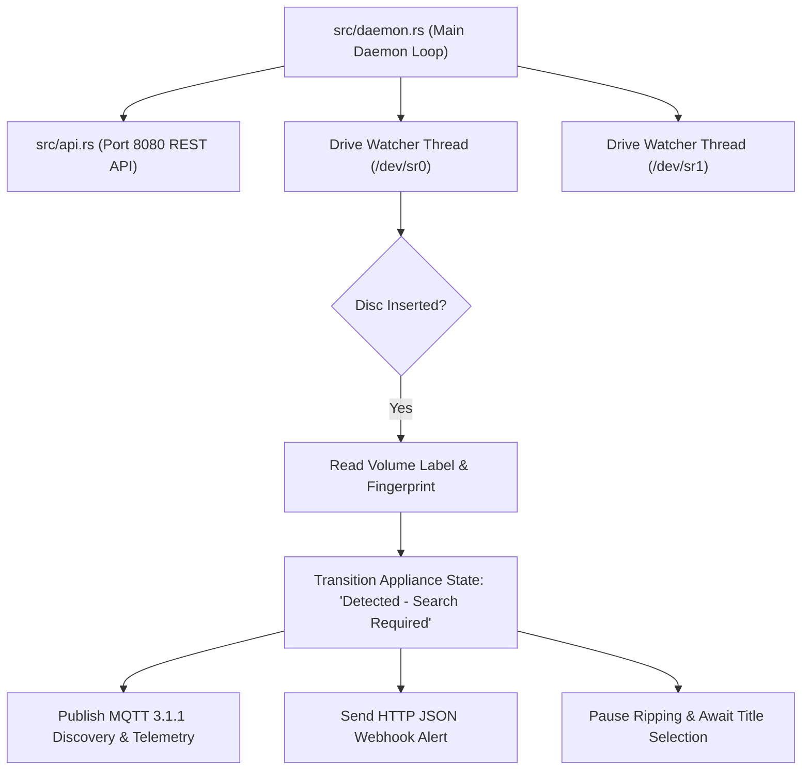

# Headless Appliance Daemon & Automation Guide

`dvd-ripper` provides a **Headless Appliance Daemon Mode** (`--daemon`) designed for un-attended media servers, network-attached storage (NAS) devices (Unraid, TrueNAS, Proxmox VE), dedicated Linux backup appliances, and home automation systems.

When launched with `--daemon`, `dvd-ripper` operates as a background service: monitoring optical drives for disc insertion, fetching metadata, publishing telemetry over Home Assistant MQTT, sending HTTP webhook alerts, and exposing an embedded HTTP REST API and HTML5 web dashboard.

---

## 1. Launching Daemon Mode

To launch in headless daemon mode:

```bash
# Basic Daemon Mode
dvd-ripper --daemon

# Daemon Mode with Home Assistant MQTT & Webhook Telemetry
dvd-ripper --daemon --mqtt-broker mqtt://192.168.1.50:1883 --webhook-url https://discord.com/api/webhooks/... --min-free-gb 20
```

---

## 2. Multi-Drive Watcher Architecture

When daemon mode starts, `dvd-ripper`:
1. Launches the embedded HTTP REST API server on port **8080** (`http://localhost:8080`).
2. Detects all connected physical optical DVD drives (`/dev/sr0`, `/dev/sr1`, `D:\`, `E:\`).
3. Spawns an independent background watcher thread (`spawn_drive_watcher`) for each drive.
4. Continuously polls optical drive volume descriptors every 3 seconds (`poll_interval_secs`).



---

## 3. Controlled Selection Workflow Lifecycle

To prevent accidental ripping of incorrect movies when ambiguous optical volume labels (e.g. `DVD_VIDEO`, `UNTITLED`) are detected, `dvd-ripper` enforces a **Controlled Selection Workflow**:

```text
[Idle] ──(Disc Inserted)──> [Detected - Search Required] ──(Select Title)──> [Ready / Ripping] ──(Complete)──> [Idle]
```

### State Machine Lifecycle Steps:

1. **`Idle`**: Drive is empty or tray is open.
2. **`Detected - Search Required`**: A new optical disc is inserted into the drive. Auto-ripping is **paused**. Telemetry alerts are sent via MQTT and Webhooks requesting user verification.
3. **Candidate Search & Selection**:
   - The user searches candidates via the Web UI Dashboard (`http://localhost:8080`), CLI (`dvd-ripper --search "Aliens"`), or REST API (`GET /api/search?q=Aliens`).
   - The user selects the target candidate (`POST /api/select?imdb_id=tt0090605`).
4. **`Ready / Ripping`**: The **▶ Start Rip** button or API endpoint (`POST /api/rip`) is unlocked, initiating background FFmpeg extraction.
5. **`Completed`**: Ripping finishes, media server scans are triggered (Plex/Jellyfin), notification alerts fire, and the optical tray is automatically ejected.

---

## 4. Home Assistant MQTT 3.1.1 Integration

`dvd-ripper` features a pure Rust binary MQTT 3.1.1 encoder (`src/mqtt.rs`) with **Home Assistant Auto-Discovery** support.

### 4.1 Configuration
Pass `--mqtt-broker mqtt://<BROKER_IP>:1883` or add `mqtt_broker = "192.168.1.50:1883"` to `dvd-ripper.toml`.

### 4.2 Auto-Discovery Sensor Topic Schema
Upon connection, `dvd-ripper` automatically publishes Home Assistant MQTT discovery payloads to:

```text
homeassistant/sensor/dvd_ripper_status/config
homeassistant/sensor/dvd_ripper_disc/config
homeassistant/sensor/dvd_ripper_progress/config
homeassistant/sensor/dvd_ripper_speed/config
```

### 4.3 Telemetry Payload Schema
State updates are published to `homeassistant/sensor/dvd_ripper/state`:

```json
{
  "status": "Ripping",
  "disc": "KILL_BILL_VOL1",
  "title": "Kill Bill: Vol. 1",
  "progress": 64.5,
  "fps": "28.5",
  "speed": "2.4x"
}
```

---

## 5. HTTP Webhook Notifications

Configure `--webhook-url <URL>` to receive real-time HTTP JSON alerts compatible with **Discord**, **Slack**, **Ntfy**, **Telegram**, and **Gotify**.

### Webhook JSON Payload Schema
```json
{
  "event": "Disc Inserted",
  "disc": "ALIENS_DISC1",
  "status": "Detected - Search Required",
  "message": "New DVD disc inserted. Search and select movie to begin ripping.",
  "timestamp": "2026-08-21 16:04:12"
}
```

---

## 6. Embedded Web REST API & Appliance Dashboard

When daemon mode is active, access the web control panel at **`http://localhost:8080`**:

- **Appliance Monitoring**: View live progress bar, current disc volume label, active FPS, and speed.
- **Search & Candidate Selection**: Use the integrated OMDb/IMDb search bar to select titles.
- **Remote Appliance Control**: Trigger rip jobs (`POST /api/rip`), cancel jobs (`POST /api/cancel`), or eject the drive tray (`POST /api/eject`).

---

## 7. Production Linux Daemon Deployment

### Systemd Service Setup
1. Copy `contrib/dvd-ripper.service` to `/etc/systemd/system/dvd-ripper.service`.
2. Enable and start the service:
   ```bash
   sudo systemctl daemon-reload
   sudo systemctl enable --now dvd-ripper.service
   ```
3. Inspect daemon logs:
   ```bash
   journalctl -u dvd-ripper.service -f
   ```
