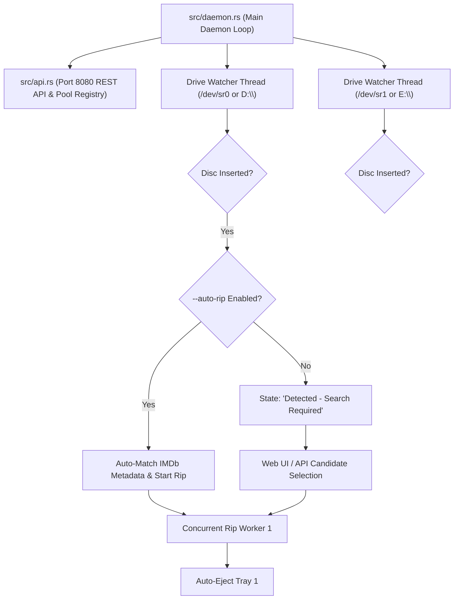

# Headless Appliance Daemon & Automation Guide

`dvd-ripper` provides a **Headless Appliance Daemon Mode** (`--daemon`) designed for un-attended media servers, network-attached storage (NAS) devices (Unraid, TrueNAS, Proxmox VE), dedicated Linux backup appliances, and home automation systems.

When launched with `--daemon`, `dvd-ripper` operates as a background service: monitoring optical drives for disc insertion, fetching metadata, publishing telemetry over Home Assistant MQTT, sending HTTP webhook alerts, and exposing an embedded HTTP REST API and HTML5 web dashboard.

---

## 1. Launching Daemon Mode

To launch in headless daemon mode:

```bash
# Basic Daemon Mode (Controlled Selection Workflow: waits for Web UI/CLI confirmation)
dvd-ripper --daemon

# Multi-Drive Pool Monitoring (monitors D: and E: concurrently)
dvd-ripper --daemon --drives "D:\,E:\"

# Unattended Auto-Rip Mode (automatically detects metadata, rips, and auto-ejects)
dvd-ripper --daemon --auto-rip

# Multi-Drive Appliance with Auto-Rip and Home Assistant Telemetry
dvd-ripper --daemon --drives "D:\,E:\" --auto-rip --mqtt-broker mqtt://192.168.1.50:1883 --webhook-url https://discord.com/api/webhooks/... --min-free-gb 20
```

---

## 2. Multi-Drive Concurrent Watcher Architecture

When daemon mode starts, `dvd-ripper`:
1. Launches the embedded HTTP REST API server on port **8080** (`http://localhost:8080`).
2. Discovers or resolves all optical drives configured via `--drive-pool` / `--drives` (or auto-detects all connected drives `/dev/sr0`, `/dev/sr1`, `D:\`, `E:\` when `auto` is set).
3. Initializes the thread-safe `DrivePoolState` registry and per-drive independent cancellation flags.
4. Spawns an independent background watcher thread (`spawn_drive_watcher`) for each drive in the pool.
5. Monitors each drive simultaneously—allowing simultaneous disc detection, concurrent background ripping, and independent optical tray ejection.


```mermaid
graph TD
    Daemon["src/daemon.rs (Main Daemon Loop)"] --> API["src/api.rs (Port 8080 REST API & Pool Registry)"]
    Daemon --> Watcher1["Drive Watcher Thread (/dev/sr0 or D:\\)"]
    Daemon --> Watcher2["Drive Watcher Thread (/dev/sr1 or E:\\)"]
    Watcher1 --> DiscCheck1{"Disc Inserted?"}
    Watcher2 --> DiscCheck2{"Disc Inserted?"}
    DiscCheck1 -- Yes --> AutoCheck1{"--auto-rip Enabled?"}
    AutoCheck1 -- Yes --> Query1["Auto-Match IMDb Metadata & Start Rip"]
    AutoCheck1 -- No --> StatusUpdate1["State: 'Detected - Search Required'"]
    StatusUpdate1 --> WebUI1["Web UI / API Candidate Selection"]
    Query1 --> Rip1["Concurrent Rip Worker 1"]
    WebUI1 --> Rip1
    Rip1 --> Eject1["Auto-Eject Tray 1"]
```

---

## 3. Workflow Lifecycles: Controlled vs Unattended Auto-Rip

`dvd-ripper` supports two operational models:

### 3.1 Controlled Selection Workflow (Default)
To prevent accidental ripping of incorrect movies when ambiguous optical volume labels (e.g. `DVD_VIDEO`, `UNTITLED`) are detected, `dvd-ripper` pauses upon disc insertion:
```text
[Idle] ──(Disc Inserted)──> [Detected - Search Required] ──(Select Title)──> [Ready / Ripping] ──(Complete)──> [Idle]
```
1. **`Idle`**: Drive is empty or tray is open.
2. **`Detected - Search Required`**: A new optical disc is inserted into the drive. Auto-ripping is **paused**. Telemetry alerts are sent via MQTT and Webhooks requesting user verification.
3. **Candidate Search & Selection**:
   - The user searches candidates via the Web UI Dashboard (`http://localhost:8080`), CLI (`dvd-ripper --search "Aliens"`), or REST API (`GET /api/search?q=Aliens`).
   - The user selects the target candidate (`POST /api/select?imdb_id=tt0090605&drive=D:\`).
4. **`Ready / Ripping`**: The **▶ Start Rip** button or API endpoint (`POST /api/rip?drive=D:\`) is unlocked, initiating background FFmpeg extraction.
5. **`Completed`**: Ripping finishes, media server scans are triggered (Plex/Jellyfin), notification alerts fire, and the optical tray is automatically ejected.

### 3.2 Unattended Auto-Rip Mode (`--auto-rip`)
When launched with `--auto-rip`, the daemon operates fully hands-off:
```text
[Idle] ──(Disc Inserted)──> [Auto-Identifying Metadata] ──(High Confidence Match)──> [Ripping] ──(Auto-Eject)──> [Idle]
```
- Disc insertion immediately queries IMDb/TMDb using the normalized ISO-9660 volume label.
- High-confidence candidates automatically begin ripping in a dedicated thread.
- Upon completion, media server scans trigger and the disc is automatically ejected.

---

## 4. Home Assistant MQTT 3.1.1 Integration

`dvd-ripper` features a pure Rust binary MQTT 3.1.1 encoder (`src/mqtt.rs`) with **Home Assistant Auto-Discovery** support.

### 4.1 Configuration
Pass `--mqtt-broker mqtt://<BROKER_IP>:1883` or add `mqtt_broker = "192.168.1.50:1883"` to `dvd-ripper.toml`.

### 4.2 Auto-Discovery Sensor Topic Schema
Upon connection, `dvd-ripper` automatically publishes Home Assistant MQTT discovery payloads to:

```text
homeassistant/sensor/dvd_ripper_status/config
homeassistant/sensor/dvd_ripper_disc/config
homeassistant/sensor/dvd_ripper_progress/config
homeassistant/sensor/dvd_ripper_speed/config
```

### 4.3 Telemetry Payload Schema
State updates are published to `homeassistant/sensor/dvd_ripper/state`:

```json
{
  "status": "Ripping",
  "disc": "KILL_BILL_VOL1",
  "title": "Kill Bill: Vol. 1",
  "progress": 64.5,
  "fps": "28.5",
  "speed": "2.4x"
}
```

---

## 5. HTTP Webhook Notifications

Configure `--webhook-url <URL>` to receive real-time HTTP JSON alerts compatible with **Discord**, **Slack**, **Ntfy**, **Telegram**, and **Gotify**.

### Webhook JSON Payload Schema
```json
{
  "event": "Disc Inserted",
  "disc": "ALIENS_DISC1",
  "status": "Detected - Search Required",
  "message": "New DVD disc inserted. Search and select movie to begin ripping.",
  "timestamp": "2026-08-21 16:04:12"
}
```

---

## 6. Embedded Web REST API & Appliance Dashboard

When daemon mode is active, access the web control panel at **`http://localhost:8080`**:

- **Multi-Drive Dashboard**: Renders interactive cards for every optical drive in the pool with independent progress bars, disc labels, and controls.
- **Drive Pool Status API (`GET /api/pool/status` or `GET /api/status?drive=D:\`)**: Returns array of all monitored optical drives and their real-time state.
- **Per-Drive Candidate Selection (`POST /api/select?imdb_id=...&drive=D:\`)**: Binds chosen metadata to a specific drive.
- **Per-Drive Rip Execution (`POST /api/rip?drive=D:\`)**: Concurrently launches ripping for that drive without blocking others.
- **Per-Drive Instant Cancellation (`POST /api/cancel?drive=D:\`)**: Kills the FFmpeg worker for that drive only.
- **Per-Drive Optical Tray Ejection (`POST /api/eject?drive=D:\`)**: Opens the optical tray for that specific drive.

---

## 7. Production Linux Daemon Deployment

### Systemd Service Setup
1. Copy `contrib/dvd-ripper.service` to `/etc/systemd/system/dvd-ripper.service`.
2. Enable and start the service:
   ```bash
   sudo systemctl daemon-reload
   sudo systemctl enable --now dvd-ripper.service
   ```
3. Inspect daemon logs:
   ```bash
   journalctl -u dvd-ripper.service -f
   ```
