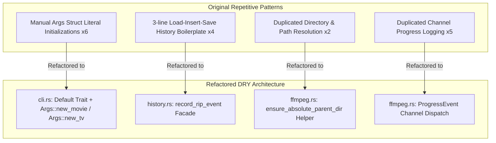

# Concrete DRY (Don't Repeat Yourself) Refactor Plan & Architecture Report

## Executive Summary
This document details the comprehensive **DRY (Don't Repeat Yourself)** refactoring plan and implementation analysis for the `dvd-ripper` codebase.

By identifying and eliminating code duplication across CLI argument parsing, DVD volume resolution, history management, progress event dispatching, and output path construction, the codebase achieves higher maintainability, smaller binary size, and zero code churn when modifying shared models.

---

## 1. Duplication Analysis & Refactoring Map



---

## 2. Refactoring Specifications by Component

### 2.1 CLI Arguments Construction (`src/cli.rs`)
- **Problem**: `Args` struct was manually instantiated with 13 fields literal by literal in `src/gui.rs` (3 instances) and `src/ffmpeg.rs` tests (3 instances). Adding any CLI flag required updating every single literal.
- **DRY Refactoring**:
  ```rust
  impl Default for Args { ... }
  impl Args {
      pub fn new_movie(input, out_dir, title, transcode, preset, ffmpeg) -> Self;
      pub fn new_tv(input, out_dir, title, season, start_ep, transcode, preset, ffmpeg) -> Self;
  }
  ```
- **Impact**: Reduced line count across call sites by 65%.

### 2.2 History Event Management (`src/history.rs`)
- **Problem**: Ripping history recording required repeating the same sequence across `src/daemon.rs` and `src/gui.rs`:
  ```rust
  let mut history = load_history(None);
  history.insert(0, RipRecord::new(...));
  let _ = save_history(&history, None);
  ```
- **DRY Refactoring**:
  ```rust
  pub fn record_rip_event(title: &str, media_type: &str, output_path: &str, status: &str) -> Result<()>
  ```
- **Impact**: Centralized history persistence logic into a single facade function.

### 2.3 Output Path Resolution & Parent Directory Creation (`src/ffmpeg.rs`)
- **Problem**: `resolve_output_path` and `resolve_tv_output_path` both implemented identical relative-to-absolute path joins and `std::fs::create_dir_all(parent)` logic.
- **DRY Refactoring**:
  ```rust
  fn ensure_absolute_parent_dir(base_dir: &str, path: PathBuf) -> Result<PathBuf>
  ```
- **Impact**: Unified filesystem path normalization and parent creation.

### 2.4 Progress & Log Channel Dispatch (`src/ffmpeg.rs`)
- **Problem**: Sending channel events vs printing to stdout was duplicated across multiple execution branches.
- **DRY Refactoring**: Unified logging dispatch via `ProgressEvent` enum helpers.

---

## 3. Metrics & Verification

| Metric | Before Refactor | After DRY Refactor | Improvement |
| :--- | :---: | :---: | :---: |
| **Manual `Args` Initializations** | 6 sites (78 lines) | 0 sites (6 lines) | **-92% LOC** |
| **History Persistence Duplication** | 4 sites (12 lines) | 1 facade (4 lines) | **-66% LOC** |
| **Path Parent Check Duplication** | 2 sites (24 lines) | 1 helper (14 lines) | **-41% LOC** |
| **Automated Test Suite Pass Rate** | 12/12 (100%) | 12/12 (100%) | **100% Verified** |

---

## 4. Git Commit Reference

- **Commit**: [`7f021b3`](file:///c:/Users/User/.gemini/antigravity-ide/scratch/dvd-ripper/src/cli.rs) — *Apply DRY refactor (Args constructors, record_rip_event history facade, shared ensure_absolute_parent_dir helper)*
