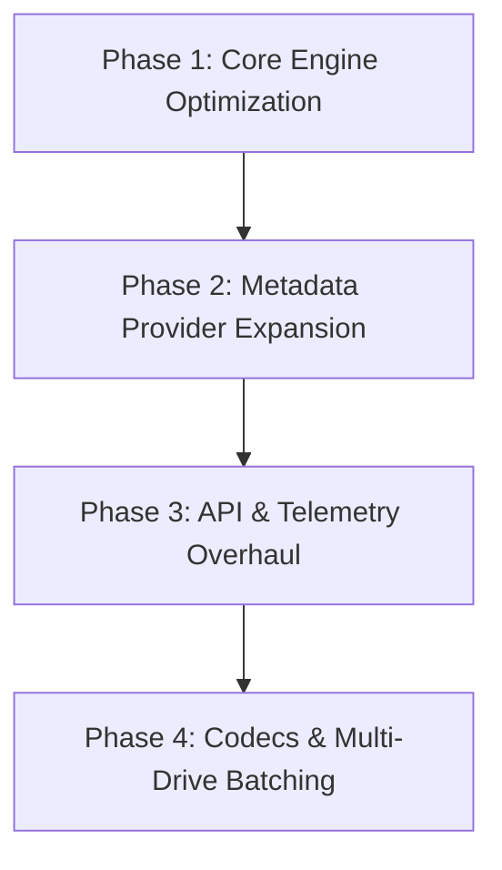

# Architectural Analysis & Refactor Plan: DVD Ripper

## 1. Executive Summary

`dvd-ripper` is a Rust application designed to automate ripping DVD movies and TV series using FFmpeg's `dvdvideo` demuxer, IMDb/OMDb metadata search, Home Assistant MQTT telemetry, and an embedded REST/Web UI appliance interface.

While the codebase is functional, responsive, and cross-platform (supporting Windows, Linux, and macOS), an analysis of the source code reveals opportunities for **architectural refinement**, **performance optimization**, **protocol compliance**, and **feature expansion**.

This document provides a source code audit, identifies technical debt, and outlines a concrete 4-phase refactor plan for missing features and system upgrades.

---

## 2. Codebase Audit & Technical Debt Matrix

| Component | File Link | Current Implementation | Identified Issue / Limit | Refactor / Missing Feature Goal |
|---|---|---|---|---|
| **DVD Demuxer & Probing** | [`src/ffmpeg.rs`](file:///c:/Users/User/.gemini/antigravity-ide/scratch/dvd-ripper/src/ffmpeg.rs#L118-L179) | Spawns up to 99 sequential `ffmpeg` subprocesses (`probe_dvd_titles`) to find title durations. | Slow execution (takes 10-30s per disc); heavy OS subprocess overhead; fragile stderr parsing. | Parse DVD `VTS_01_0.IFO` headers or use `ffprobe` JSON API to retrieve all title track metadata in a single call (~0.5s). |
| **Encrypted DVDs (CSS)** | [`src/dvd.rs`](file:///c:/Users/User/.gemini/antigravity-ide/scratch/dvd-ripper/src/dvd.rs) | Relies on system FFmpeg having `libdvdcss` linked in. | Commercial encrypted DVDs fail if FFmpeg lacks CSS keys or fails demuxing. | Integrate `libdvdread` / `libdvdcss` bindings or fallback libdvdcss key decryption pass. |
| **Metadata Engine** | [`src/imdb.rs`](file:///c:/Users/User/.gemini/antigravity-ide/scratch/dvd-ripper/src/imdb.rs) | Uses OMDb API (requires user API key for full details) and undocumented IMDb Suggest API endpoints. | OMDb rate limits; IMDb suggest endpoint schema shifts; missing episode titles for TV series. | Add **TMDB (The Movie Database)** API provider with free API keys, cast metadata, posters, and per-episode names. |
| **MQTT Telemetry** | [`src/mqtt.rs`](file:///c:/Users/User/.gemini/antigravity-ide/scratch/dvd-ripper/src/mqtt.rs#L21-L53) | Sends HTTP POST payload over raw TCP socket to port 1883 instead of binary MQTT protocol. | Incompatible with standard MQTT brokers (Mosquitto, EMQX); missing Home Assistant discovery. | Implement standard MQTT v3.1.1/v5 protocol using `rumqttc` with Home Assistant MQTT Auto-Discovery (`homeassistant/sensor/...`). |
| **REST API Server** | [`src/api.rs`](file:///c:/Users/User/.gemini/antigravity-ide/scratch/dvd-ripper/src/api.rs#L306-L360) | Handcrafted `TcpListener` HTTP server with manual string parsing and 2-second HTTP polling. | Lacks standard HTTP router; line-based header parsing; no real-time push streaming. | Migrate to lightweight HTTP framework with **Server-Sent Events (SSE)** or WebSockets for live progress streaming. |
| **Video Encoding & Codecs** | [`src/ffmpeg.rs`](file:///c:/Users/User/.gemini/antigravity-ide/scratch/dvd-ripper/src/ffmpeg.rs#L303-L337) | Hardcoded `h264` hardware acceleration parameters; output restricted to `.mp4` or `.mpg`. | Missing modern codecs (H.265/HEVC, AV1) and MKV container support (which supports DVD VOBsub subtitles without re-encoding). | Add `.mkv` Matroska container support, HEVC/AV1 encoding profiles, and custom audio bitrate/codec controls. |
| **Multi-Drive Batching** | [`src/daemon.rs`](file:///c:/Users/User/.gemini/antigravity-ide/scratch/dvd-ripper/src/daemon.rs) | Polling watcher monitors a single active drive path. | Multi-drive servers (e.g. 4 optical drives in a rack unit) cannot rip concurrently. | Multi-threaded concurrent drive monitor daemon processing multiple optical drives simultaneously. |

---

## 3. Concrete Refactor Plan



### Phase 1: Core Engine & Fast DVD Structure Probing

#### 1.1 Direct IFO/UDF Header Parsing
* **Problem**: `probe_dvd_titles()` in [`src/ffmpeg.rs`](file:///c:/Users/User/.gemini/antigravity-ide/scratch/dvd-ripper/src/ffmpeg.rs#L123) loops from 1 to 99, invoking `ffmpeg` individually for each title to extract `Duration: HH:MM:SS`.
* **Solution**:
  - Implement a fast binary parser for `VIDEO_TS/VTS_01_0.IFO` or run `ffprobe -show_entries program=program_id,duration -of json` in a single invocation.
  - Reduces disc scanning time from ~20 seconds to <0.5 seconds.

#### 1.2 Subtitle Extraction & OCR Support
* **Problem**: Subtitles on DVDs are bitmap-based (`dvdsub` / VOBsub). MP4 containers cannot natively embed bitmap subtitles without hardburning.
* **Solution**:
  - Add Matroska (`.mkv`) output container support, allowing direct bitstream copy of `dvdsub` bitmap tracks without quality loss or re-encoding.
  - Optional integration with `tesseract` OCR to extract `dvdsub` into text-based `.srt` sidecar files.

---

### Phase 2: Metadata & API Provider Expansion

#### 2.1 The Movie Database (TMDB) Integration
* **Problem**: Relying solely on OMDb requires users to register for an OMDb API key, while IMDb Suggest API does not provide episode names or full artwork.
* **Solution**:
  - Implement TMDB REST API client in [`src/imdb.rs`](file:///c:/Users/User/.gemini/antigravity-ide/scratch/dvd-ripper/src/imdb.rs).
  - Provider fallback chain: `TMDB` -> `OMDb` -> `Local DVD Label Heuristic`.
  - Automatically map TV episode numbers to real episode titles (e.g. `S01E01 - Pilot.mkv` instead of generic `S01E01.mkv`).

#### 2.2 Poster & Fanart Caching
* **Solution**:
  - Save downloaded poster artwork into output movie folders as `cover.jpg` / `folder.jpg` for Plex, Jellyfin, and Emby media server compatibility.

---

### Phase 3: REST API & Telemetry Overhaul

#### 3.1 True MQTT Protocol & Home Assistant Auto-Discovery
* **Problem**: [`src/mqtt.rs`](file:///c:/Users/User/.gemini/antigravity-ide/scratch/dvd-ripper/src/mqtt.rs) sends raw HTTP over TCP port 1883 instead of real MQTT binary packets.
* **Solution**:
  - Integrate `rumqttc` crate for native MQTT v3.1.1 / v5 support.
  - Publish Home Assistant MQTT Discovery configs under `homeassistant/sensor/dvd_ripper/config` so Home Assistant automatically creates entities for `Sensor State`, `Ripping Progress %`, and `Inserted Disc Label`.

#### 3.2 Server-Sent Events (SSE) Live Progress Streaming
* **Problem**: Web dashboard in [`src/api.rs`](file:///c:/Users/User/.gemini/antigravity-ide/scratch/dvd-ripper/src/api.rs#L298) polls `/api/status` every 2 seconds.
* **Solution**:
  - Add `/api/events` Server-Sent Events (SSE) endpoint to push real-time FFmpeg progress logs, FPS, ETA, and progress bar updates instantly.

#### 3.3 Multi-Channel Push Notifications
* **Solution**:
  - Extend notification engine in [`src/mqtt.rs`](file:///c:/Users/User/.gemini/antigravity-ide/scratch/dvd-ripper/src/mqtt.rs#L56) to natively format Webhook payloads for **Telegram**, **Pushover**, **Gotify**, **Discord**, and **Ntfy**.

---

### Phase 4: Video Codecs, Presets & Multi-Drive Batching

#### 4.1 HEVC (H.265) & AV1 Encoding Profiles
* **Solution**:
  - Add `--codec` option supporting `h264`, `hevc` (H.265), `av1`, and `copy`.
  - Add transcoding presets:
    - `Archival Lossless`: MKV container, copy video/audio streams, keep all subtitles.
    - `Plex 1080p`: MP4 container, H.264/HEVC CR 20, AAC 192k audio.
    - `Mobile 720p`: Fast H.264, lower bitrates for streaming to phones.

#### 4.2 Multi-Drive Parallel Appliance Daemon
* **Problem**: [`src/daemon.rs`](file:///c:/Users/User/.gemini/antigravity-ide/scratch/dvd-ripper/src/daemon.rs#L22-L55) monitors one drive at a time in a single loop.
* **Solution**:
  - Use `detect_dvd_drives()` to spawn a dedicated worker thread per optical drive.
  - Allow headless servers with 2+ DVD drives to rip multiple discs simultaneously in parallel.

---

## 4. Proposed Project Structure Post-Refactor

```text
dvd-ripper/
├── Cargo.toml
├── refactor_plan.md
├── src/
│   ├── main.rs                 # Main CLI & GUI launch entry point
│   ├── cli.rs                  # Extended CLI argument definitions
│   ├── core/
│   │   ├── dvd.rs              # Cross-platform drive detection & volume label reader
│   │   ├── ifo.rs              # [NEW] Direct VTS IFO & DVD structure binary parser
│   │   ├── ffmpeg.rs           # FFmpeg invocation, HWACCEL, progress parser
│   │   └── presets.rs          # [NEW] Encoding profile presets (Plex, Archival, Mobile)
│   ├── providers/
│   │   ├── mod.rs              # Unified metadata provider traits
│   │   ├── tmdb.rs             # [NEW] The Movie Database API client
│   │   ├── omdb.rs             # OMDb API client
│   │   └── imdb.rs             # IMDb suggest fallback client
│   ├── services/
│   │   ├── api.rs              # Web REST API & SSE progress push engine
│   │   ├── daemon.rs           # Multi-drive parallel auto-rip watcher service
│   │   ├── mqtt.rs             # Native rumqttc client + Home Assistant discovery
│   │   └── webhooks.rs         # Telegram / Gotify / Discord webhook notifier
│   └── ui/
│       ├── gui.rs              # eframe / egui desktop UI with multi-drive controls
│       └── dashboard.rs        # HTML5 / WebUI embedded assets
```

---

## 5. Implementation Roadmap & Verification

1. **Phase 1 Implementation**: Create `src/core/ifo.rs` and optimize `probe_dvd_titles()` in [`src/ffmpeg.rs`](file:///c:/Users/User/.gemini/antigravity-ide/scratch/dvd-ripper/src/ffmpeg.rs).
2. **Phase 2 Implementation**: Add TMDB provider to [`src/imdb.rs`](file:///c:/Users/User/.gemini/antigravity-ide/scratch/dvd-ripper/src/imdb.rs).
3. **Phase 3 Implementation**: Replace raw TCP MQTT payload with `rumqttc` and SSE streaming in [`src/api.rs`](file:///c:/Users/User/.gemini/antigravity-ide/scratch/dvd-ripper/src/api.rs).
4. **Phase 4 Implementation**: Add HEVC/AV1/MKV presets and multi-drive daemon threads in [`src/daemon.rs`](file:///c:/Users/User/.gemini/antigravity-ide/scratch/dvd-ripper/src/daemon.rs).
5. **Verification**: Execute unit tests (`cargo test`), verify fast probing speed (<1s), test Home Assistant auto-discovery, and validate multi-drive parallel ripping.
