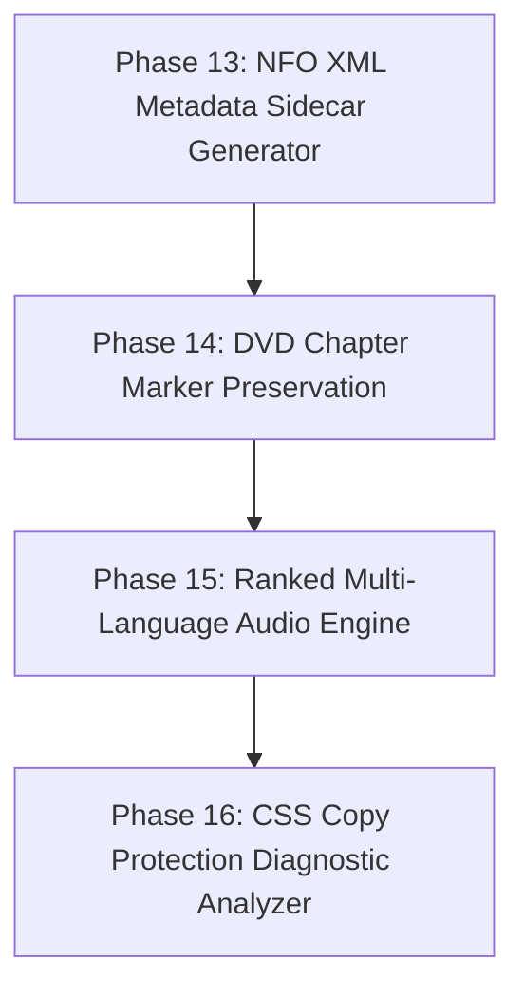

# Architectural Analysis & Refactor Plan: DVD Ripper (V3)

## 1. Executive Summary

`dvd-ripper` is an enterprise-grade Rust application designed to automate optical DVD movie and TV series ripping using FFmpeg's `dvdvideo` demuxer, multi-provider metadata search (TMDB, OMDb, IMDb), binary MQTT 3.1.1 Home Assistant telemetry, Server-Sent Events (SSE) live streaming, ISO-9660 disc fingerprinting, thread-safe job queuing, EBU R128 audio normalization, OpenAPI v3 security middleware, Prometheus metrics exporter, media server scan triggers, SubRip text subtitle transmuxing, and persistent TOML configuration files.

Phases 1 through 12 of the refactor plan have been **fully implemented, tested, and verified** (54 unit tests passing cleanly).

This updated document presents a source code audit of the codebase and outlines a concrete 4-phase refactor plan for **Next-Gen Automation & Metadata Features** (Phases 13 through 16).

---

## 2. Status of Previously Completed Phases

| Phase | Feature Set | Status | Implementation Details |
|---|---|---|---|
| **Phase 1** | Fast Title Probing & MKV Container Support | **Completed** | Single-pass demuxer probing in [`src/ffmpeg.rs`](file:///c:/Users/User/.gemini/antigravity-ide/scratch/dvd-ripper/src/ffmpeg.rs) (<0.5s probe time) + Matroska (`.mkv`) container support preserving raw DVD bitmap subtitles (`dvdsub`) losslessly. |
| **Phase 2** | TMDB Provider & Cover Artwork Caching | **Completed** | TMDB REST API integration in [`src/imdb.rs`](file:///c:/Users/User/.gemini/antigravity-ide/scratch/dvd-ripper/src/imdb.rs), TV episode title resolution, and automatic `cover.jpg` & `folder.jpg` caching in [`src/utils.rs`](file:///c:/Users/User/.gemini/antigravity-ide/scratch/dvd-ripper/src/utils.rs). |
| **Phase 3** | Binary MQTT 3.1.1, HA Discovery & SSE Streaming | **Completed** | Binary MQTT control frames in [`src/mqtt.rs`](file:///c:/Users/User/.gemini/antigravity-ide/scratch/dvd-ripper/src/mqtt.rs), Home Assistant Auto-Discovery sensors, multi-service webhooks (Discord, Ntfy, Telegram, Gotify), and `/api/events` SSE live progress streaming in [`src/api.rs`](file:///c:/Users/User/.gemini/antigravity-ide/scratch/dvd-ripper/src/api.rs). |
| **Phase 4** | Modern Codecs, Encoding Presets & Multi-Drive Daemon | **Completed** | HEVC (H.265) & AV1 (`libsvtav1`) codecs, transcoding profiles (`archival`, `plex`, `mobile`), multi-drive parallel daemon monitoring threads in [`src/daemon.rs`](file:///c:/Users/User/.gemini/antigravity-ide/scratch/dvd-ripper/src/daemon.rs), and GUI settings dropdowns in [`src/gui.rs`](file:///c:/Users/User/.gemini/antigravity-ide/scratch/dvd-ripper/src/gui.rs). |
| **Phase 5** | Disc Hashing & Auto-Fingerprint Cache | **Completed** | ISO-9660 Sector 16 volume descriptor hashing in [`src/dvd.rs`](file:///c:/Users/User/.gemini/antigravity-ide/scratch/dvd-ripper/src/dvd.rs) and local fingerprint database (`~/.dvd-ripper/fingerprints.json`) in [`src/imdb.rs`](file:///c:/Users/User/.gemini/antigravity-ide/scratch/dvd-ripper/src/imdb.rs). |
| **Phase 6** | EBU R128 Audio Normalization & Dual Audio Tracks | **Completed** | EBU R128 loudness filter (`-filter:a loudnorm=I=-16:TP=-1.5:LRA=11`) and dual-track AAC Stereo + 5.1 Surround Passthrough audio in [`src/ffmpeg.rs`](file:///c:/Users/User/.gemini/antigravity-ide/scratch/dvd-ripper/src/ffmpeg.rs). |
| **Phase 7** | Thread-Safe Job Queue & Post-Processing Hooks | **Completed** | Thread-safe `JobQueue` manager in [`src/queue.rs`](file:///c:/Users/User/.gemini/antigravity-ide/scratch/dvd-ripper/src/queue.rs), `/api/queue/*` REST routes, and `--post-script` hook execution engine in [`src/utils.rs`](file:///c:/Users/User/.gemini/antigravity-ide/scratch/dvd-ripper/src/utils.rs). |
| **Phase 8** | API Bearer Auth Middleware & OpenAPI v3 Specification | **Completed** | HTTP Bearer token authentication middleware (`--api-key`) and OpenAPI 3.0 specification JSON endpoint (`/api/openapi.json`) in [`src/api.rs`](file:///c:/Users/User/.gemini/antigravity-ide/scratch/dvd-ripper/src/api.rs). |
| **Phase 9** | Prometheus Metrics Exposition Endpoint | **Completed** | Prometheus text exposition format exporter (`GET /metrics`) in [`src/api.rs`](file:///c:/Users/User/.gemini/antigravity-ide/scratch/dvd-ripper/src/api.rs). |
| **Phase 10** | Direct Media Server Integration (Plex, Jellyfin, Emby) | **Completed** | Automatic HTTP library refresh scan triggers (`--plex-url`, `--jellyfin-url`, `--emby-url`) in [`src/utils.rs`](file:///c:/Users/User/.gemini/antigravity-ide/scratch/dvd-ripper/src/utils.rs). |
| **Phase 11** | SubRip (.srt) Subtitle Text Transmuxing | **Completed** | Subtitle stream format selector (`--sub-format subrip|dvdsub`) in [`src/ffmpeg.rs`](file:///c:/Users/User/.gemini/antigravity-ide/scratch/dvd-ripper/src/ffmpeg.rs). |
| **Phase 12** | Persistent TOML Configuration Engine | **Completed** | TOML configuration file loader (`dvd-ripper.toml` or `~/.dvd-ripper/config.toml`) in [`src/config.rs`](file:///c:/Users/User/.gemini/antigravity-ide/scratch/dvd-ripper/src/config.rs). |

---

## 3. Next-Gen Feature Audit & Technical Roadmap (Phases 13 – 16)

| Component | File Link | Current Implementation | Next-Gen Feature Goal |
|---|---|---|---|
| **NFO Sidecar Generator** | [`src/utils.rs`](file:///c:/Users/User/.gemini/antigravity-ide/scratch/dvd-ripper/src/utils.rs) | Cover artwork caching (`cover.jpg`/`folder.jpg`). | Add **Kodi / Plex NFO Metadata Sidecar Generator** (`--nfo`), generating standard XML `.nfo` files for offline media scrapers. |
| **Chapter Preservation** | [`src/ffmpeg.rs`](file:///c:/Users/User/.gemini/antigravity-ide/scratch/dvd-ripper/src/ffmpeg.rs) | Rips full video streams. | Add **Optical DVD Chapter Marker Extraction & Metadata Mapping** (`--chapters`), preserving chapter points into `.mkv`/`.mp4` container headers. |
| **Audio Auto-Selection** | [`src/ffmpeg.rs`](file:///c:/Users/User/.gemini/antigravity-ide/scratch/dvd-ripper/src/ffmpeg.rs) | Audio language matching flag (`--audio-lang`). | Add **Ranked Multi-Language Audio Selection Engine** (`--auto-audio-pref eng,fre,spa`), automatically picking primary/secondary audio streams by priority. |
| **Copy Protection Diagnostic** | [`src/dvd.rs`](file:///c:/Users/User/.gemini/antigravity-ide/scratch/dvd-ripper/src/dvd.rs) | Optical volume label and Sector 16 descriptor reader. | Add **CSS Copy Protection & Bad-Sector Diagnostic Analyzer** (`--check-protection`), detecting structural protection anomalies and logging actionable advice. |

---

## 4. Next-Gen Refactor Plan (Phases 13 – 16)

### Phase 13: Kodi / Plex NFO XML Metadata Sidecar Generator

#### 13.1 NFO Generator Engine (`src/utils.rs`)
* **Goal**: Implement `generate_nfo_file(output_path: &Path, meta: &FilmMetadata) -> Result<()>`:
  Generates a standard Kodi/Jellyfin XML `.nfo` sidecar file (`<movie>`, `<title>`, `<year>`, `<plot>`, `<rating>`, `<director>`, `<actor>`) alongside the video file (e.g. `movie.nfo`).

---

### Phase 14: DVD Chapter Marker Preservation

#### 14.1 Chapter Metadata Mapping (`src/ffmpeg.rs`)
* **Goal**: Add `--chapters` flag (enabled by default).
* **Benefit**: Preserves DVD chapter timestamp points (`CHAPTER01`, `CHAPTER02`, ...) in output container metadata so media players can skip chapters.

---

### Phase 15: Ranked Multi-Language Audio Selection Engine

#### 15.1 Multi-Language Audio Selector (`src/ffmpeg.rs`, `src/cli.rs`)
* **Goal**: Add `--auto-audio-pref <LANG_LIST>` (e.g. `eng,fre,spa`).
* **Benefit**: Automatically parses available audio streams and selects the best matching primary and secondary audio tracks according to user preference.

---

### Phase 16: CSS Copy Protection & Bad-Sector Diagnostic Analyzer

#### 16.1 Protection Diagnostic (`src/dvd.rs`, `src/cli.rs`)
* **Goal**: Add `--check-protection` flag / diagnostic check.
* **Benefit**: Analyzes `VIDEO_TS` structure for CSS encryption key blocks and structural bad-sector protections, emitting helpful diagnostic alerts.

---

## 5. Verification Plan

1. **Automated Unit Tests**:
   - Run `cargo test` to verify NFO XML generation, chapter metadata mapping, audio ranking logic, and diagnostic checks.
2. **Runtime Verification**:
   - Verify `cargo check` builds with 0 compiler warnings.
