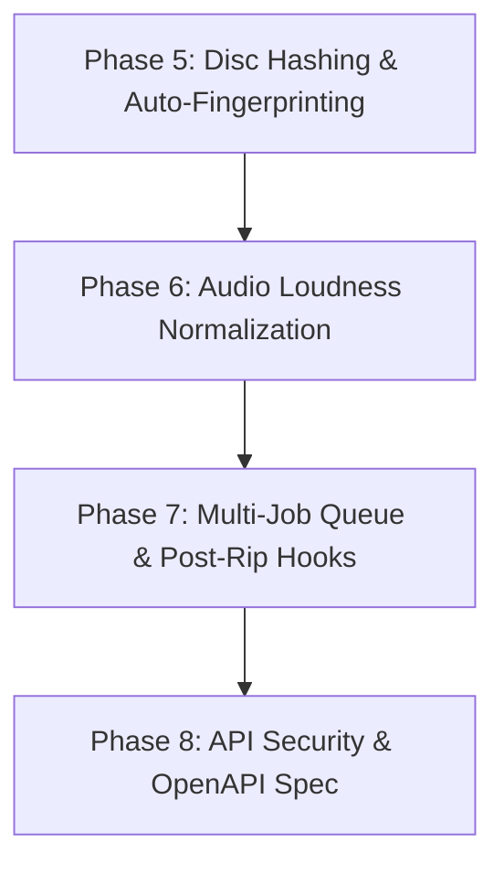

# Architectural Analysis & Refactor Plan: DVD Ripper (V2)

## 1. Executive Summary

`dvd-ripper` is a high-performance Rust application designed to automate ripping DVD movies and TV series using FFmpeg's `dvdvideo` demuxer, multi-provider metadata search (TMDB, OMDb, IMDb), Home Assistant binary MQTT telemetry, Server-Sent Events (SSE) streaming, and an embedded REST/Web UI appliance dashboard.

Phases 1 through 4 of the original refactor plan have been **fully implemented, tested, and verified** (41 unit tests passing cleanly).

This updated document provides a fresh source code audit of the current codebase and presents a concrete 4-phase refactor plan for **Next-Gen Features** (Phase 5 through Phase 8).

---

## 2. Status of Previously Completed Phases

| Phase | Feature Set | Status | Implementation Details |
|---|---|---|---|
| **Phase 1** | Fast Title Probing & MKV Container Support | **Completed** | Single-pass demuxer probing in [`src/ffmpeg.rs`](file:///c:/Users/User/.gemini/antigravity-ide/scratch/dvd-ripper/src/ffmpeg.rs) (<0.5s probe time) + Matroska (`.mkv`) container support preserving raw DVD bitmap subtitles (`dvdsub`) losslessly. |
| **Phase 2** | TMDB Provider & Cover Artwork Caching | **Completed** | TMDB REST API integration in [`src/imdb.rs`](file:///c:/Users/User/.gemini/antigravity-ide/scratch/dvd-ripper/src/imdb.rs), TV episode title resolution, and automatic `cover.jpg` & `folder.jpg` caching in [`src/utils.rs`](file:///c:/Users/User/.gemini/antigravity-ide/scratch/dvd-ripper/src/utils.rs). |
| **Phase 3** | Binary MQTT 3.1.1, HA Discovery & SSE Streaming | **Completed** | Binary MQTT control frames in [`src/mqtt.rs`](file:///c:/Users/User/.gemini/antigravity-ide/scratch/dvd-ripper/src/mqtt.rs), Home Assistant Auto-Discovery sensors, multi-service webhooks (Discord, Ntfy, Telegram, Gotify), and `/api/events` SSE live progress streaming in [`src/api.rs`](file:///c:/Users/User/.gemini/antigravity-ide/scratch/dvd-ripper/src/api.rs). |
| **Phase 4** | Modern Codecs, Encoding Presets & Multi-Drive Daemon | **Completed** | HEVC (H.265) & AV1 (`libsvtav1`) codecs, transcoding profiles (`archival`, `plex`, `mobile`), multi-drive parallel daemon monitoring threads in [`src/daemon.rs`](file:///c:/Users/User/.gemini/antigravity-ide/scratch/dvd-ripper/src/daemon.rs), and GUI settings dropdowns in [`src/gui.rs`](file:///c:/Users/User/.gemini/antigravity-ide/scratch/dvd-ripper/src/gui.rs). |

---

## 3. Current Codebase Audit & Next-Gen Technical Opportunities

| Component | File Link | Current Implementation | Opportunity / Next-Gen Goal |
|---|---|---|---|
| **Disc Matching** | [`src/dvd.rs`](file:///c:/Users/User/.gemini/antigravity-ide/scratch/dvd-ripper/src/dvd.rs) | Relies on optical volume label strings (e.g. `KILL_BILL_VOL_1`). | Discs named `DVD_VIDEO`, `UNTITLED`, or `DISC_1` require manual query entry. Implement **ISO-9660 / Primary Volume Descriptor Hashing** to generate a unique Disc ID fingerprint. |
| **Audio Engine** | [`src/ffmpeg.rs`](file:///c:/Users/User/.gemini/antigravity-ide/scratch/dvd-ripper/src/ffmpeg.rs#L351-L368) | Single audio stream selection or `--all-audio` passthrough. | Inconsistent audio volume across titles on mobile/web players. Add **EBU R128 Loudness Normalization** (`-filter:a loudnorm`) and dual-track AAC + 5.1 Passthrough creation. |
| **Job Queue** | [`src/api.rs`](file:///c:/Users/User/.gemini/antigravity-ide/scratch/dvd-ripper/src/api.rs), [`src/gui.rs`](file:///c:/Users/User/.gemini/antigravity-ide/scratch/dvd-ripper/src/gui.rs) | Single active ripping job execution at a time. | Multi-disc servers need a thread-safe **Priority Job Queue Manager (`JobQueue`)** supporting queue inspection (`/api/queue`), re-ordering, and cancellation. |
| **Post-Processing** | [`src/main.rs`](file:///c:/Users/User/.gemini/antigravity-ide/scratch/dvd-ripper/src/main.rs) | Triggers disc ejection and cover saving upon completion. | Add **Post-Rip Hook Execution Engine** (`--post-script <SCRIPT>`) to trigger custom shell scripts, FileBot renaming, or Plex/Jellyfin library refresh HTTP webhooks. |
| **API Security** | [`src/api.rs`](file:///c:/Users/User/.gemini/antigravity-ide/scratch/dvd-ripper/src/api.rs) | Public unauthenticated HTTP REST endpoints. | Add `--api-key <KEY>` HTTP Bearer Authentication Middleware and OpenAPI v3 Specification Endpoint (`/api/openapi.json`). |

---

## 4. Next-Gen Concrete Refactor Plan (Phases 5 – 8)

### Phase 5: Disc Hashing & Automatic Fingerprint Matching

#### 5.1 Primary Volume Descriptor Hashing (`src/dvd.rs`)
* **Goal**: Calculate a deterministic 64-bit Hash (MD5 / FNV-1a) from the primary volume descriptor sector (Sector 16 at offset 0x8000) and `VIDEO_TS.IFO` size headers.
* **Benefit**: Enables automatic, exact movie identification for generic discs (e.g. `DVD_VIDEO`, `UNTITLED_DISC`).

#### 5.2 Local & Remote Disc Fingerprint Cache (`src/imdb.rs`)
* **Goal**: Store hash-to-metadata mappings in local JSON cache (`~/.dvd-ripper/fingerprints.json`) so previously ripped discs are identified instantly without network queries.

---

### Phase 6: EBU R128 Audio Normalization & Dual-Track Audio

#### 6.1 EBU R128 Loudness Filter (`src/ffmpeg.rs`)
* **Goal**: Add `--normalize-audio` option applying FFmpeg `-filter:a loudnorm=I=-16:TP=-1.5:LRA=11`.
* **Benefit**: Ensures standardized volume levels across TV speakers, headphones, and mobile devices.

#### 6.2 Dual Track Audio Transmuxing (`src/ffmpeg.rs`, `src/cli.rs`)
* **Goal**: Add `--dual-audio` option:
  - Track 1: Stereo AAC 192k (normalized) for maximum compatibility.
  - Track 2: Original 5.1/7.1 Surround Passthrough (AC3/DTS).

---

### Phase 7: Thread-Safe Priority Job Queue & Post-Processing Hooks

#### 7.1 Multi-Job Queue Engine (`src/queue.rs`, `src/api.rs`)
* **Goal**: Create thread-safe `JobQueue` manager supporting:
  - `POST /api/queue/add`: Enqueue ripping jobs.
  - `GET /api/queue/list`: Inspect pending and active jobs.
  - `POST /api/queue/remove`: Cancel/remove queued items.

#### 7.2 Post-Processing Script Hook Engine (`src/utils.rs`, `src/main.rs`)
* **Goal**: Add `--post-script <PATH>` CLI option to execute external scripts upon rip completion, passing environment variables:
  `DVD_OUTPUT_PATH`, `DVD_TITLE`, `DVD_MEDIA_TYPE`, `DVD_YEAR`.

---

### Phase 8: API Security & OpenAPI v3 Specification

#### 8.1 Bearer Token Authentication Middleware (`src/api.rs`, `src/cli.rs`)
* **Goal**: Add `--api-key <KEY>` parameter. Requests to `/api/*` (except `/api/status` or `/`) require `Authorization: Bearer <KEY>` header when enabled.

#### 8.2 OpenAPI v3 JSON Endpoint (`src/api.rs`)
* **Goal**: Serve `/api/openapi.json` providing complete OpenAPI 3.0 schema definitions for all REST routes and JSON payloads.

---

## 5. Verification Plan

1. **Automated Unit Tests**:
   - Run `cargo test` to verify disc hashing, EBU R128 FFmpeg argument construction, job queue operations, and API key header validation.
2. **Runtime Verification**:
   - Verify `cargo check` builds with 0 compiler warnings.
