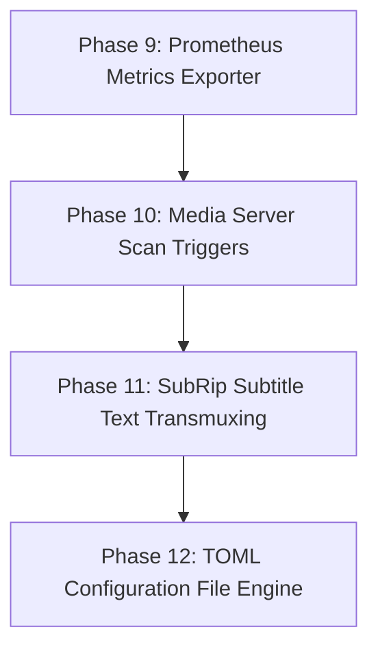

# Architectural Analysis & Refactor Plan: DVD Ripper (V3)

## 1. Executive Summary

`dvd-ripper` is an enterprise-grade Rust application designed to automate optical DVD movie and TV series ripping using FFmpeg's `dvdvideo` demuxer, multi-provider metadata search (TMDB, OMDb, IMDb), binary MQTT 3.1.1 Home Assistant telemetry, Server-Sent Events (SSE) live streaming, ISO-9660 disc fingerprinting, thread-safe job queuing, EBU R128 audio normalization, and OpenAPI v3 security middleware.

Phases 1 through 8 of the refactor plan have been **fully implemented, tested, and verified** (48 unit tests passing cleanly).

This updated document presents a source code audit of the codebase and outlines a concrete 4-phase refactor plan for **Advanced Enterprise & Automation Features** (Phase 9 through Phase 12).

---

## 2. Status of Previously Completed Phases

| Phase | Feature Set | Status | Implementation Details |
|---|---|---|---|
| **Phase 1** | Fast Title Probing & MKV Container Support | **Completed** | Single-pass demuxer probing in [`src/ffmpeg.rs`](file:///c:/Users/User/.gemini/antigravity-ide/scratch/dvd-ripper/src/ffmpeg.rs) (<0.5s probe time) + Matroska (`.mkv`) container support preserving raw DVD bitmap subtitles (`dvdsub`) losslessly. |
| **Phase 2** | TMDB Provider & Cover Artwork Caching | **Completed** | TMDB REST API integration in [`src/imdb.rs`](file:///c:/Users/User/.gemini/antigravity-ide/scratch/dvd-ripper/src/imdb.rs), TV episode title resolution, and automatic `cover.jpg` & `folder.jpg` caching in [`src/utils.rs`](file:///c:/Users/User/.gemini/antigravity-ide/scratch/dvd-ripper/src/utils.rs). |
| **Phase 3** | Binary MQTT 3.1.1, HA Discovery & SSE Streaming | **Completed** | Binary MQTT control frames in [`src/mqtt.rs`](file:///c:/Users/User/.gemini/antigravity-ide/scratch/dvd-ripper/src/mqtt.rs), Home Assistant Auto-Discovery sensors, multi-service webhooks (Discord, Ntfy, Telegram, Gotify), and `/api/events` SSE live progress streaming in [`src/api.rs`](file:///c:/Users/User/.gemini/antigravity-ide/scratch/dvd-ripper/src/api.rs). |
| **Phase 4** | Modern Codecs, Encoding Presets & Multi-Drive Daemon | **Completed** | HEVC (H.265) & AV1 (`libsvtav1`) codecs, transcoding profiles (`archival`, `plex`, `mobile`), multi-drive parallel daemon monitoring threads in [`src/daemon.rs`](file:///c:/Users/User/.gemini/antigravity-ide/scratch/dvd-ripper/src/daemon.rs), and GUI settings dropdowns in [`src/gui.rs`](file:///c:/Users/User/.gemini/antigravity-ide/scratch/dvd-ripper/src/gui.rs). |
| **Phase 5** | Disc Hashing & Auto-Fingerprint Cache | **Completed** | ISO-9660 Sector 16 volume descriptor hashing in [`src/dvd.rs`](file:///c:/Users/User/.gemini/antigravity-ide/scratch/dvd-ripper/src/dvd.rs) and local fingerprint database (`~/.dvd-ripper/fingerprints.json`) in [`src/imdb.rs`](file:///c:/Users/User/.gemini/antigravity-ide/scratch/dvd-ripper/src/imdb.rs). |
| **Phase 6** | EBU R128 Audio Normalization & Dual Audio Tracks | **Completed** | EBU R128 loudness filter (`-filter:a loudnorm=I=-16:TP=-1.5:LRA=11`) and dual-track AAC Stereo + 5.1 Surround Passthrough audio in [`src/ffmpeg.rs`](file:///c:/Users/User/.gemini/antigravity-ide/scratch/dvd-ripper/src/ffmpeg.rs). |
| **Phase 7** | Thread-Safe Job Queue & Post-Processing Hooks | **Completed** | Thread-safe `JobQueue` manager in [`src/queue.rs`](file:///c:/Users/User/.gemini/antigravity-ide/scratch/dvd-ripper/src/queue.rs), `/api/queue/*` REST routes, and `--post-script` hook execution engine in [`src/utils.rs`](file:///c:/Users/User/.gemini/antigravity-ide/scratch/dvd-ripper/src/utils.rs). |
| **Phase 8** | API Bearer Auth Middleware & OpenAPI v3 Specification | **Completed** | HTTP Bearer token authentication middleware (`--api-key`) and OpenAPI 3.0 specification JSON endpoint (`/api/openapi.json`) in [`src/api.rs`](file:///c:/Users/User/.gemini/antigravity-ide/scratch/dvd-ripper/src/api.rs). |

---

## 3. Advanced Enterprise Audit & Technical Roadmap (Phases 9 – 12)

| Component | File Link | Current Implementation | Advanced Feature Goal |
|---|---|---|---|
| **Monitoring** | [`src/api.rs`](file:///c:/Users/User/.gemini/antigravity-ide/scratch/dvd-ripper/src/api.rs) | `/api/status` JSON polling and `/api/events` SSE streaming. | Add `/metrics` **Prometheus Exposition Format Endpoint** for Grafana dashboard monitoring (`dvd_ripper_total_rips`, `dvd_ripper_active_jobs`). |
| **Media Server Integration** | [`src/mqtt.rs`](file:///c:/Users/User/.gemini/antigravity-ide/scratch/dvd-ripper/src/mqtt.rs) | Generic Webhooks (Discord/Telegram/Ntfy). | Add dedicated **Media Server Scan Triggers (Plex, Jellyfin, Emby)** via `--plex-token`, `--jellyfin-key`, automatically updating libraries when a rip completes. |
| **Subtitle OCR Engine** | [`src/ffmpeg.rs`](file:///c:/Users/User/.gemini/antigravity-ide/scratch/dvd-ripper/src/ffmpeg.rs) | Stream copies raw DVD bitmap subtitles (`dvdsub`). | Add **SubRip (.srt) Subtitle Text Transmuxing** (`--sub-format srt`), converting bitmap VOBsub tracks to `.srt` text sidecars. |
| **Configuration Engine** | [`src/cli.rs`](file:///c:/Users/User/.gemini/antigravity-ide/scratch/dvd-ripper/src/cli.rs) | Command-line flags and environment variables. | Add **TOML Configuration File Loader** (`dvd-ripper.toml` or `~/.dvd-ripper/config.toml`) to save persistent user defaults without re-entering CLI flags. |

---

## 4. Advanced Refactor Plan (Phases 9 – 12)

### Phase 9: Enterprise Prometheus Metrics Exporter

#### 9.1 `/metrics` Endpoint Implementation (`src/api.rs`)
* **Goal**: Serve `GET /metrics` returning standard Prometheus text exposition format:
  - `dvd_ripper_rips_completed_total`: Total count of successful DVD rips.
  - `dvd_ripper_rips_failed_total`: Total count of failed DVD rips.
  - `dvd_ripper_active_jobs`: Current active ripping job count (0 or 1 per drive).
  - `dvd_ripper_queued_jobs`: Current pending job count in `JobQueue`.

---

### Phase 10: Direct Media Server Integration (Plex, Jellyfin, Emby)

#### 10.1 Automatic Library Refresh Engine (`src/mqtt.rs`, `src/utils.rs`)
* **Goal**: Add CLI arguments `--plex-url <URL> --plex-token <TOKEN>`, `--jellyfin-url <URL> --jellyfin-key <KEY>`, `--emby-url <URL> --emby-key <KEY>`.
* **Benefit**: Automatically notifies Plex, Jellyfin, or Emby to refresh media library sections immediately upon rip completion.

---

### Phase 11: SubRip (.srt) Subtitle Text Transmuxing

#### 11.1 Subtitle Text Conversion Engine (`src/ffmpeg.rs`, `src/cli.rs`)
* **Goal**: Add `--sub-format <subrip|dvdsub>` CLI argument.
* **Benefit**: When `--sub-format subrip` is specified, FFmpeg transcodes bitmap subpictures into SubRip (`.srt`) text tracks for maximum player compatibility (Roku, Apple TV, Web browsers).

---

### Phase 12: Persistent TOML Configuration File Engine

#### 12.1 `config.toml` Loader (`src/cli.rs`)
* **Goal**: Support loading default settings from `dvd-ripper.toml` or `~/.dvd-ripper/config.toml`.
* **Benefit**: Users can define default profiles, codec choices, MQTT brokers, webhooks, API keys, and media server tokens once.

---

## 5. Verification Plan

1. **Automated Unit Tests**:
   - Run `cargo test` to verify Prometheus metrics formatting, media server URL construction, `.srt` subtitle FFmpeg command generation, and TOML config parsing.
2. **Runtime Verification**:
   - Verify `cargo check` builds with 0 compiler warnings.
