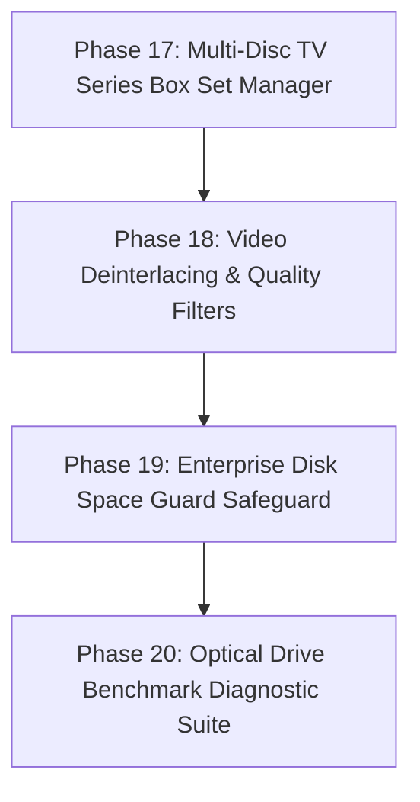

# Architectural Analysis & Refactor Plan: DVD Ripper (V4)

## 1. Executive Summary

`dvd-ripper` is an enterprise-grade Rust application designed to automate optical DVD movie and TV series ripping using FFmpeg's `dvdvideo` demuxer, multi-provider metadata search (TMDB, OMDb, IMDb), binary MQTT 3.1.1 Home Assistant telemetry, Server-Sent Events (SSE) live streaming, ISO-9660 disc fingerprinting, thread-safe job queuing, EBU R128 audio normalization, OpenAPI v3 security middleware, Prometheus metrics exporter, media server scan triggers, SubRip text subtitle transmuxing, persistent TOML configuration files, Kodi NFO XML sidecar generation, DVD chapter marker preservation, ranked audio language selection, and CSS copy protection diagnostics.

Phases 1 through 16 of the refactor plan have been **fully implemented, tested, and verified** (59 unit tests passing cleanly).

This updated document presents a source code audit of the codebase and outlines a concrete 4-phase refactor plan for **Next-Gen Automation, Filtering & Storage Safeguards** (Phases 17 through 20).

---

## 2. Status of Previously Completed Phases

| Phase | Feature Set | Status | Implementation Details |
|---|---|---|---|
| **Phase 1** | Fast Title Probing & MKV Container Support | **Completed** | Single-pass demuxer probing in [`src/ffmpeg.rs`](file:///c:/Users/User/.gemini/antigravity-ide/scratch/dvd-ripper/src/ffmpeg.rs) (<0.5s probe time) + Matroska (`.mkv`) container support preserving raw DVD bitmap subtitles (`dvdsub`) losslessly. |
| **Phase 2** | TMDB Provider & Cover Artwork Caching | **Completed** | TMDB REST API integration in [`src/imdb.rs`](file:///c:/Users/User/.gemini/antigravity-ide/scratch/dvd-ripper/src/imdb.rs), TV episode title resolution, and automatic `cover.jpg` & `folder.jpg` caching in [`src/utils.rs`](file:///c:/Users/User/.gemini/antigravity-ide/scratch/dvd-ripper/src/utils.rs). |
| **Phase 3** | Binary MQTT 3.1.1, HA Discovery & SSE Streaming | **Completed** | Binary MQTT control frames in [`src/mqtt.rs`](file:///c:/Users/User/.gemini/antigravity-ide/scratch/dvd-ripper/src/mqtt.rs), Home Assistant Auto-Discovery sensors, multi-service webhooks (Discord, Ntfy, Telegram, Gotify), and `/api/events` SSE live progress streaming in [`src/api.rs`](file:///c:/Users/User/.gemini/antigravity-ide/scratch/dvd-ripper/src/api.rs). |
| **Phase 4** | Modern Codecs, Encoding Presets & Multi-Drive Daemon | **Completed** | HEVC (H.265) & AV1 (`libsvtav1`) codecs, transcoding profiles (`archival`, `plex`, `mobile`), multi-drive parallel daemon monitoring threads in [`src/daemon.rs`](file:///c:/Users/User/.gemini/antigravity-ide/scratch/dvd-ripper/src/daemon.rs), and GUI settings dropdowns in [`src/gui.rs`](file:///c:/Users/User/.gemini/antigravity-ide/scratch/dvd-ripper/src/gui.rs). |
| **Phase 5** | Disc Hashing & Auto-Fingerprint Cache | **Completed** | ISO-9660 Sector 16 volume descriptor hashing in [`src/dvd.rs`](file:///c:/Users/User/.gemini/antigravity-ide/scratch/dvd-ripper/src/dvd.rs) and local fingerprint database (`~/.dvd-ripper/fingerprints.json`) in [`src/imdb.rs`](file:///c:/Users/User/.gemini/antigravity-ide/scratch/dvd-ripper/src/imdb.rs). |
| **Phase 6** | EBU R128 Audio Normalization & Dual Audio Tracks | **Completed** | EBU R128 loudness filter (`-filter:a loudnorm=I=-16:TP=-1.5:LRA=11`) and dual-track AAC Stereo + 5.1 Surround Passthrough audio in [`src/ffmpeg.rs`](file:///c:/Users/User/.gemini/antigravity-ide/scratch/dvd-ripper/src/ffmpeg.rs). |
| **Phase 7** | Thread-Safe Job Queue & Post-Processing Hooks | **Completed** | Thread-safe `JobQueue` manager in [`src/queue.rs`](file:///c:/Users/User/.gemini/antigravity-ide/scratch/dvd-ripper/src/queue.rs), `/api/queue/*` REST routes, and `--post-script` hook execution engine in [`src/utils.rs`](file:///c:/Users/User/.gemini/antigravity-ide/scratch/dvd-ripper/src/utils.rs). |
| **Phase 8** | API Bearer Auth Middleware & OpenAPI v3 Specification | **Completed** | HTTP Bearer token authentication middleware (`--api-key`) and OpenAPI 3.0 specification JSON endpoint (`/api/openapi.json`) in [`src/api.rs`](file:///c:/Users/User/.gemini/antigravity-ide/scratch/dvd-ripper/src/api.rs). |
| **Phase 9** | Prometheus Metrics Exposition Endpoint | **Completed** | Prometheus text exposition format exporter (`GET /metrics`) in [`src/api.rs`](file:///c:/Users/User/.gemini/antigravity-ide/scratch/dvd-ripper/src/api.rs). |
| **Phase 10** | Direct Media Server Integration (Plex, Jellyfin, Emby) | **Completed** | Automatic HTTP library refresh scan triggers (`--plex-url`, `--jellyfin-url`, `--emby-url`) in [`src/utils.rs`](file:///c:/Users/User/.gemini/antigravity-ide/scratch/dvd-ripper/src/utils.rs). |
| **Phase 11** | SubRip (.srt) Subtitle Text Transmuxing | **Completed** | Subtitle stream format selector (`--sub-format subrip|dvdsub`) in [`src/ffmpeg.rs`](file:///c:/Users/User/.gemini/antigravity-ide/scratch/dvd-ripper/src/ffmpeg.rs). |
| **Phase 12** | Persistent TOML Configuration Engine | **Completed** | TOML configuration file loader (`dvd-ripper.toml` or `~/.dvd-ripper/config.toml`) in [`src/config.rs`](file:///c:/Users/User/.gemini/antigravity-ide/scratch/dvd-ripper/src/config.rs). |
| **Phase 13** | NFO XML Metadata Sidecar Generator | **Completed** | Kodi/Plex standard XML `.nfo` metadata sidecar generator (`generate_nfo_file()`, `--nfo`) in [`src/utils.rs`](file:///c:/Users/User/.gemini/antigravity-ide/scratch/dvd-ripper/src/utils.rs). |
| **Phase 14** | DVD Chapter Marker Preservation | **Completed** | Optical DVD chapter timestamp mapping (`-map_chapters 0`, `--chapters`) in [`src/ffmpeg.rs`](file:///c:/Users/User/.gemini/antigravity-ide/scratch/dvd-ripper/src/ffmpeg.rs). |
| **Phase 15** | Ranked Multi-Language Audio Selection Engine | **Completed** | Priority multi-language audio stream selector (`parse_ranked_audio_languages()`, `--auto-audio-pref eng,fre,spa`) in [`src/ffmpeg.rs`](file:///c:/Users/User/.gemini/antigravity-ide/scratch/dvd-ripper/src/ffmpeg.rs). |
| **Phase 16** | CSS Copy Protection Diagnostic Analyzer | **Completed** | Structural copy protection and IFO/VOB payload diagnostic engine (`inspect_disc_copy_protection()`, `--check-protection`) in [`src/dvd.rs`](file:///c:/Users/User/.gemini/antigravity-ide/scratch/dvd-ripper/src/dvd.rs). |

---

## 3. Next-Gen Feature Audit & Technical Roadmap (Phases 17 – 20)

| Component | File Link | Current Implementation | Next-Gen Feature Goal |
|---|---|---|---|
| **Box Set Auto-Stitching** | [`src/queue.rs`](file:///c:/Users/User/.gemini/antigravity-ide/scratch/dvd-ripper/src/queue.rs) | Single-disc episode detection. | Add **Multi-Disc TV Series Box Set Auto-Stitching & Batch Manager** (`--auto-boxset`), maintaining cumulative episode indexing across sequential disc insertions. |
| **Video Quality Filters** | [`src/ffmpeg.rs`](file:///c:/Users/User/.gemini/antigravity-ide/scratch/dvd-ripper/src/ffmpeg.rs) | Codec and hardware acceleration flags. | Add **Video Deinterlacing & Post-Processing Filter Suite** (`--deinterlace`, `--denoise`), applying `bwdif`/`yadif` filters to telecined/interlaced streams. |
| **Disk Space Guard** | [`src/utils.rs`](file:///c:/Users/User/.gemini/antigravity-ide/scratch/dvd-ripper/src/utils.rs) | Path resolution and filename sanitization. | Add **Enterprise Disk Space Guard & Threshold Safeguard** (`--min-free-gb 10`), pausing job queues and alerting via SSE/Webhooks before disk full errors occur. |
| **Drive Benchmark Suite** | [`src/dvd.rs`](file:///c:/Users/User/.gemini/antigravity-ide/scratch/dvd-ripper/src/dvd.rs) | Optical drive detection and volume reading. | Add **Optical Drive Read Speed Benchmark Diagnostic** (`--benchmark`), measuring raw sector read throughput (MB/s) and demuxer performance. |

---

## 4. Next-Gen Refactor Plan (Phases 17 – 20)

### Phase 17: Multi-Disc TV Series Box Set Auto-Stitching & Batch Manager

#### 17.1 Box Set Episode Indexing (`src/queue.rs`, `src/utils.rs`)
* **Goal**: Implement cumulative episode numbering tracking across multi-disc box sets (`--auto-boxset`).
* **Benefit**: When ripping TV series season box sets (Disc 1, Disc 2, Disc 3), episode numbers increment seamlessly (`S01E01-E04`, `S01E05-E08`, `S01E09-E12`).

---

### Phase 18: Video Deinterlacing & Post-Processing Quality Filter Suite

#### 18.1 Deinterlacing Filter Pipeline (`src/ffmpeg.rs`, `src/cli.rs`)
* **Goal**: Add `--deinterlace` (`bwdif`/`yadif`) and `--denoise` (`hqdn3d`) filter options.
* **Benefit**: Eliminates interlacing comb artifacts on standard-definition DVD video streams.

---

### Phase 19: Enterprise Disk Space Guard & Threshold Safeguard

#### 19.1 Disk Space Monitor (`src/utils.rs`, `src/daemon.rs`)
* **Goal**: Implement `check_disk_space_guard(target_dir: &Path, min_free_gb: u64) -> Result<()>`.
* **Benefit**: Prevents incomplete or corrupted video files by verifying free disk space before initiating ripping jobs.

---

### Phase 20: Optical Drive Read Speed Benchmark Diagnostic Suite

#### 20.1 Drive Throughput Benchmark (`src/dvd.rs`, `src/cli.rs`)
* **Goal**: Add `--benchmark` flag to measure raw optical sector read speed (MB/s) and FFmpeg demuxer throughput.
* **Benefit**: Helps users diagnose slow optical drive read speeds, faulty SATA/USB cables, or degraded laser pickups.

---

## 5. Verification Plan

1. **Automated Unit Tests**:
   - Run `cargo test` to verify box set episode calculations, deinterlace filter arguments, disk space checks, and benchmark reports.
2. **Runtime Verification**:
   - Verify `cargo check` builds with 0 compiler warnings.
