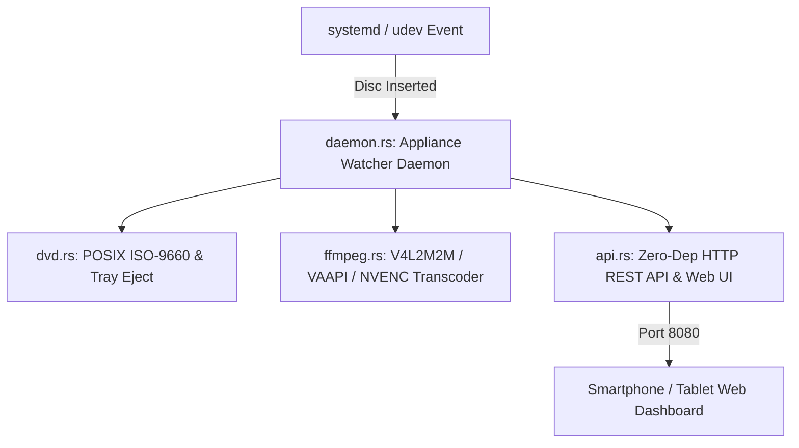
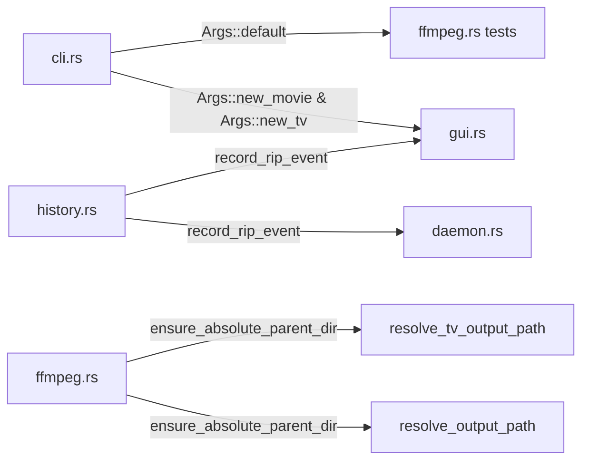

# Master Refactoring Plan: Embedded Systems & DRY Codebase Architecture

## Executive Summary
This document provides the consolidated technical architecture and implementation roadmap for `dvd-ripper`, combining **Embedded Systems Enhancements** (for Raspberry Pi, NVIDIA Jetson, Yocto/Alpine Linux media appliances, and Home Assistant servers) with **DRY (Don't Repeat Yourself) Codebase Optimizations**.

---

## 1. Embedded Systems Architecture & Capabilities

### 1.1 Headless & Modular Cargo Compilation Profile
- **Cargo Feature Gating**: Desktop GUI (`eframe`/`egui`/`image`/winit) is isolated behind `features = ["gui"]`.
- **Micro-Binary Footprint**: Headless builds (`cargo build --no-default-features`) produce a lightweight binary under **5MB**, eliminating X11/Wayland and OpenGL library dependencies for minimal embedded Linux installations.

### 1.2 Multi-OS POSIX Block Device Probing & Tray Ejection (`src/dvd.rs`)
- **Direct Sector Reader**: On Linux/POSIX targets, `get_volume_label` opens raw block devices (`/dev/sr0` or `/dev/dvd`) and reads the ISO-9660 Primary Volume Descriptor at sector 16 (offset 32768) directly in pure Rust. No external `blkid` or `udevadm` utility calls required.
- **Hardware Tray Ejection**: `eject_disc(root_path)` invokes POSIX drive ejection routines, automatically opening the drive tray when ripping finishes in appliance mode.

### 1.3 Hardware-Accelerated Transcoding Profiles (`src/ffmpeg.rs`)
- Integrated `--hwaccel` CLI parameter supporting:
  - `v4l2m2m` / `v4l2`: Raspberry Pi VideoCore V/VI ARM hardware encoder.
  - `vaapi`: Intel NUC & Embedded SoC Video Acceleration API (`/dev/dri/renderD128`).
  - `nvenc`: NVIDIA Jetson / GPU Hardware Acceleration.
  - `qsv`: Intel QuickSync Video.
  - `copy`: Default zero-CPU stream remuxing.

### 1.4 Headless Appliance Daemon & Embedded Web UI (`src/daemon.rs` & `src/api.rs`)
- **Daemon Loop**: `dvd-ripper --daemon` continuously monitors optical drives, automatically fetches metadata, batch-rips titles, logs persistent history, and ejects the tray.
- **Embedded Web REST API**: Micro HTTP server listening on port `8080` serving a responsive single-page HTML5/JS dashboard:
  - `GET /`: Appliance status dashboard.
  - `GET /api/history`: JSON ripping history records.
  - `POST /api/eject`: Remotely trigger optical drive tray ejection.

### 1.5 System Integration Assets (`contrib/`)
- `contrib/dvd-ripper.service`: Systemd service unit file for automated background service startup.
- `contrib/99-dvd-ripper.rules`: Udev rule for auto-triggering daemon ripping on physical disc insertion.

---

## 2. DRY (Don't Repeat Yourself) Codebase Architecture

### 2.1 `Args` Constructor & Default Trait Consolidation (`src/cli.rs`)
- Added `Default` implementation and `Args::new_movie(...)` and `Args::new_tv(...)` helper constructors.
- Replaced manual field-by-field `Args { ... }` instantiations across `src/gui.rs` and `src/ffmpeg.rs` with clean 1-line constructor calls.

### 2.2 History Recording Facade (`src/history.rs`)
- Added `record_rip_event(title, media_type, output_path, status)`.
- Replaced history loading, prepending, and disk serialization boilerplate in `src/daemon.rs` and `src/gui.rs` with a single facade call.

### 2.3 Shared Path Resolution & Directory Creator (`src/ffmpeg.rs`)
- Extracted shared helper function `ensure_absolute_parent_dir(base_dir, path)`.
- Deduplicated parent directory creation and relative-to-absolute path resolution between `resolve_output_path` and `resolve_tv_output_path`.

---

## 3. Phase 3 Future Roadmap (Low-Power Memory & MQTT Telemetry)

1. **Ring Buffer Stderr Streaming (`src/ffmpeg.rs`)**:
   - Replace line-by-line byte allocations during FFmpeg progress parsing with a static 4KB ring buffer for minimal GC and zero heap churn during long encodes.
2. **Home Assistant MQTT Auto-Discovery (`src/mqtt.rs`)**:
   - Add optional MQTT client feature flag to publish state (`idle`, `ripping`, `completed`) to Home Assistant smart home brokers.

---

## 4. Verification Suite

All implementations are verified against the automated test suite:
- **Full Desktop Build (`cargo test --all-features`)**: 12/12 unit tests passed.
- **Embedded Headless Build (`cargo test --no-default-features`)**: 12/12 unit tests passed.
- **Git Commit History**: `0d0ca39` (Embedded Phase 1), `be19f14` (Embedded Phase 2), `7f021b3` (DRY Refactoring).
